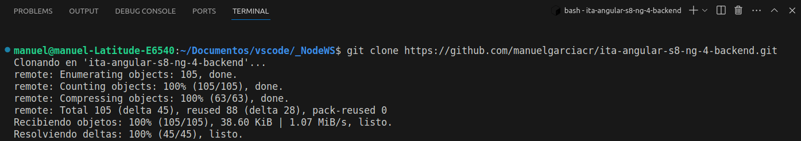
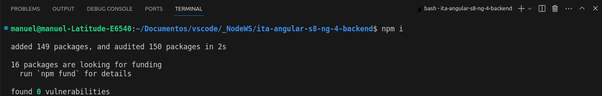
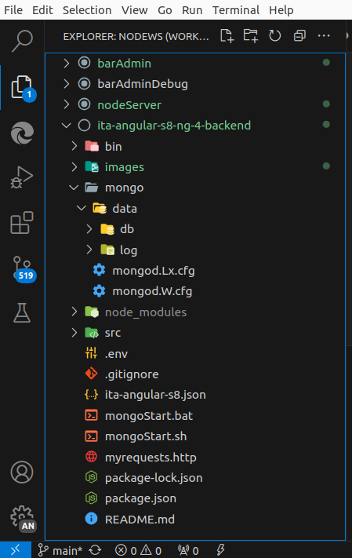
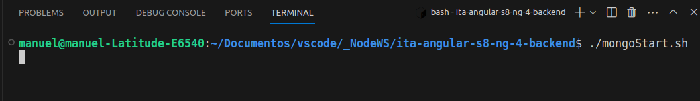
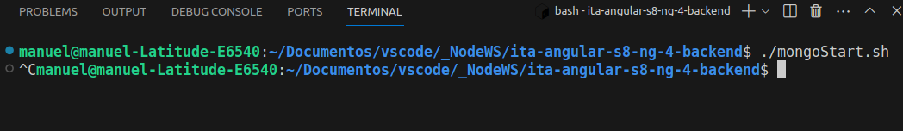
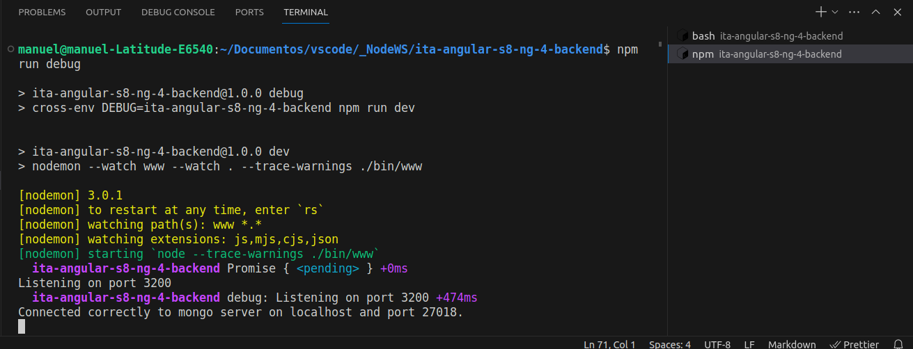

# IT Academy Sprint 8 Angular IV Inprocode. Backend

### Environment setup

## Clone repository

git clone https://github.com/manuelgarciacr/ita-angular-s8-ng-4-backend.git

## Install dependencies

Install dependencies with "npm i"

## Add the folder to the vscode workspace

## Install mongo on your local device

https://www.mongodb.com/try/download/community

## Technologies

* Nodejs server: Express
* BDD: MongoDB Community
* Mongo ODM: Mongoose
* Hashing: Bcryptjs
* Debug: Debug
* Logger: Morgan
* HTTP response headers security: Helmet

## Start the mongo DB

The DB will be created in the '/mongo' folder within the project itself. The mongo URL is hardcoded inside the .env file in the project root, along with the express server port.

The files mongod.Lx.cfg and mongod.W.cfg have the configuration data for a Linux or Windows system.

From a bash terminal you can run the Linux shell script typing "./mongoStart.sh", or the Windows batch file "./mongoStart.bat"

Control+C from the terminal, will close the DB.

## Start the Express server

Opening a new terminal, you can start the server in debug developing mode: "npm run debug", developing mode: "npm run dev" or production mode: "npm start"

Control + C to stop the server.

This is the debug developing terminal:

